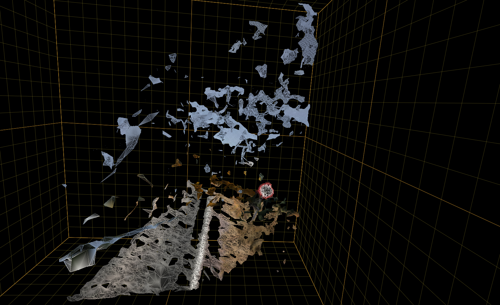
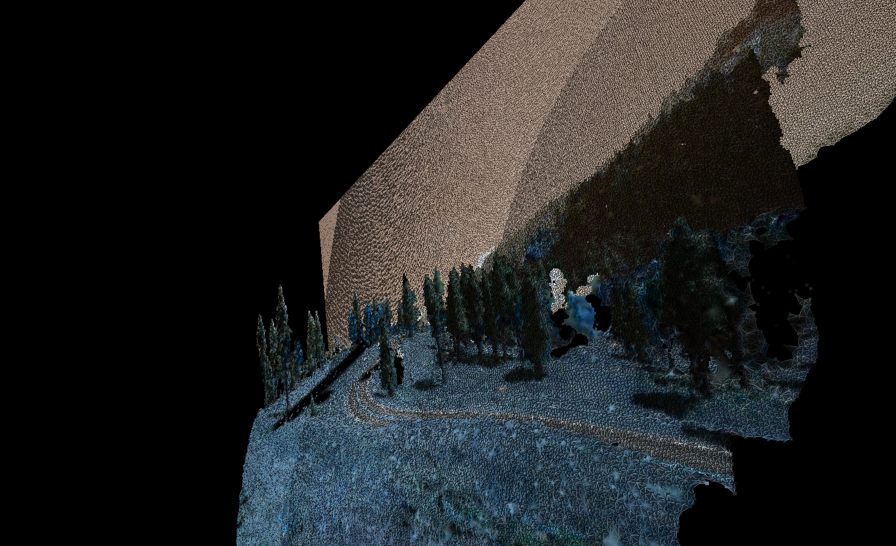

# Visual SLAM 

## What is visual slam 

Simultaneous Localization and Mapping

- Map the location, output: 3d map
- locate itself on the map

## Monocular V-SLAM

It means that we only have one camera, harder than stereo, because we cannot calculate depth 

## Deep learning in VSLAM

[Paper](https://arxiv.org/abs/1803.02286)

## Random notes 

Image sequence, different lighting etc, how to beat it: from the intro to computer vision course, we learned a color map where the illumination is a paremeter, so it could be used for better representaion -> HSV, HLS -> opencv has it 

Feature points: these are some points that are easy to detect, for example if we can detect corners, those points could be easily used to track movement.

Image flow: a movement map basically, where did the __objects__ go. If we talk about objects, we need to detect them.

For example a bounding box, or an instance segmented description could be used from pixel to pixel

## Traditional approach

Components:
First: Tracking, Input: Image/frame, this includes feature extraction pose estimation, and local map tracking -> ouput: keyframe, and input for relocalization 

Second: Mapping, Input: Keyframe from Tracking, this includees map points definition, local bundle adjustment, keyyframe culling -> output: pose and map, and input for Loop closing

Loop closing: voltunk-e mar itt? 

## generated mesh from one point cloud with stereo cameras

## generated mesh from point cloud using the depth and rgb image

